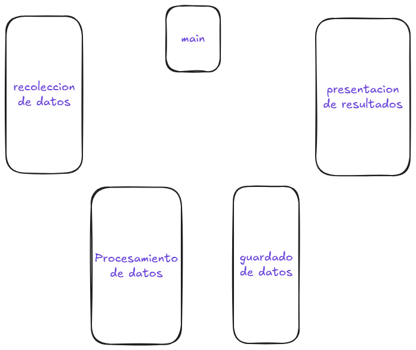
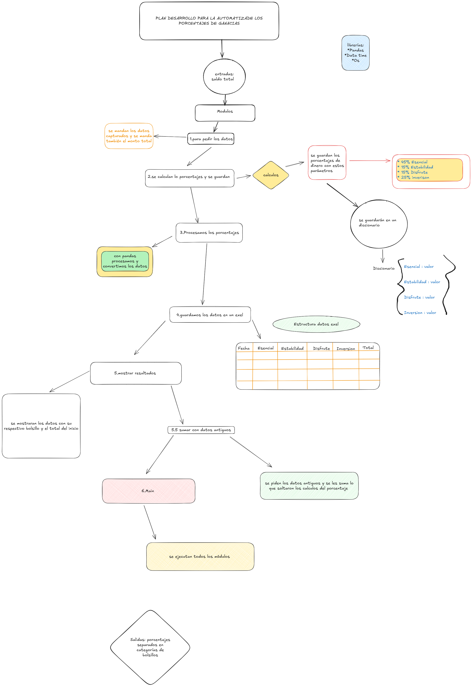

# 🏗️ Arquitectura del Sistema

## 1. Vista General de Módulos

El sistema se divide en 5 componentes principales controlados por el `main`:

Cada módulo cumple una función independiente, lo que facilita el mantenimiento y escalabilidad.

---

## 2. Flujo de Procesos

El siguiente diagrama describe el flujo completo desde la entrada de datos hasta la presentación final:

1️⃣ Se recolectan los datos →  
2️⃣ Se calculan los porcentajes →  
3️⃣ Se procesan y guardan →  
4️⃣ Se presentan los resultados finales.

---

## 3. diseño uix

este este es el diseño base que tendra la uix

